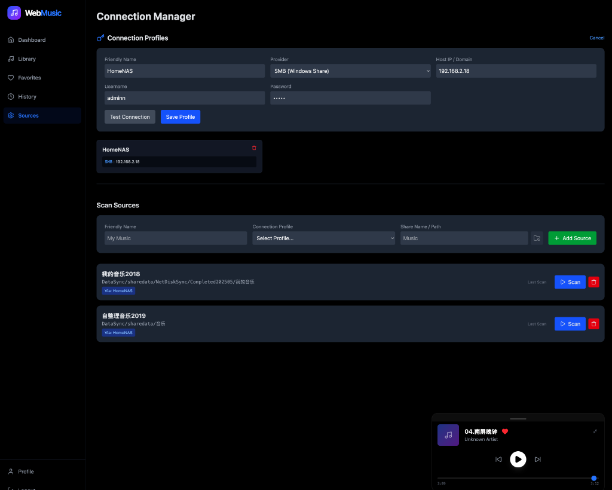
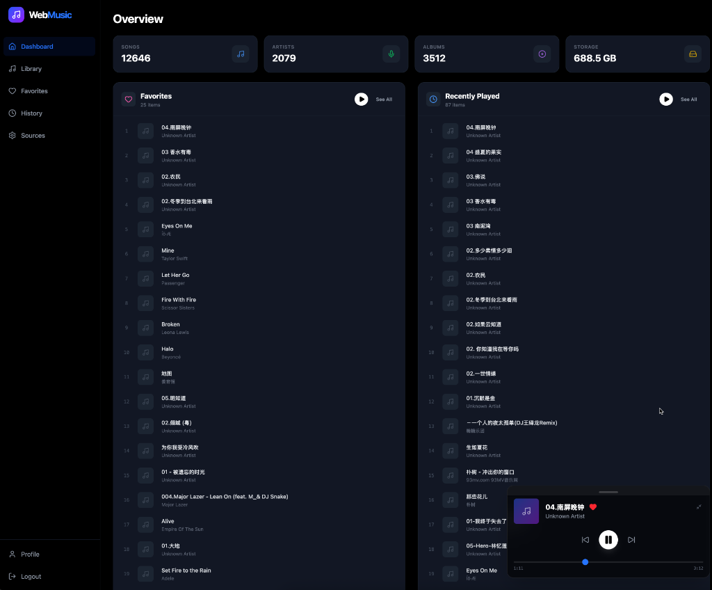
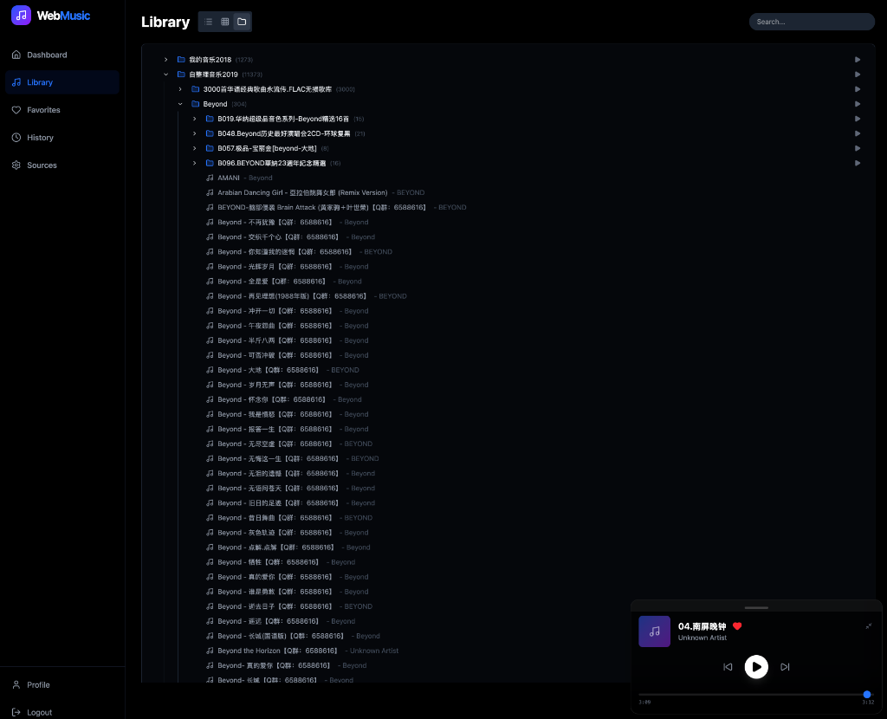

# WebMusic

A modern, web-based music player and library manager designed for NAS (Network Attached Storage) and SMB shares. Built with .NET 8 (Backend) and React + Vite (Frontend).

**Live Demo**: [https://music.maifeipin.com/sources](https://music.maifeipin.com/sources)

## Features

### Core Integration
- **SMB Integration**: Directly connect to Windows Shares / SMB servers to scan and stream music.
  
  
- **Background Scanning**: Asynchronous scanning pipeline with real-time status updates, capable of handling large libraries without timeout.
- **Deduplication**: Intelligent handling of physical files to prevent duplicate library entries across multiple shares.

### AI Tag Manager 🤖
- **Intelligent Metadata Cleanup**: Use **Google Gemini AI** models (Flash 2.0/1.5) to automatically analyze filenames and suggest accurate Artist/Title tags.
- **Batch Processing**: Filter songs by folder or metadata criteria (e.g., "No Artist") and process them in bulk.
- **Diff View**: Preview changes side-by-side before applying them to your database.
- **Smart Prompts**: Built-in templates for common tasks like "Fix Encoding" or "Genre Classification".

### Library Management
- **Shared Playlists**: Create public, shareable links for your playlists with optional passwords and expiration dates.
- **Backup & Restore**: Full JSON export/import of library metadata and Favorites lists. Supports appending or overwriting data for migration.
- **Cover Art**: Upload custom cover images or fetch from SMB automatically.

### Playback & Audio
- **Global Player**: Persistent playback bar with minimize/maximize support, play queue, and improved seek controls.
- **Transcoding**: Automatic transcoding (via FFmpeg) for unsupported formats (FLAC/ALAC -> MP3/AAC) with seeking support.
- **Smart Queue**: Add songs, folders, or entire groups to queue.

### User Experience
- **Modern Dashboard**: Auto-responsive layout featuring "Recently Played", "Favorites", and Library Stats.
  
  
- **Directory Browser**: Interactive file browser to easily select SMB shares and folders.
- **Library Views**:
    - **Flat View**: Sortable list of all songs with Path column.
    - **Group View**: Browse by Artist, Album, Genre, or Year.
    - **Directory View**: Navigate your physical folder structure with breadcrumbs.
  
  
- **User Profile**:
    - Listening History and Favorites Management.
    - Secure "Change Password" functionality.

## Tech Stack

### Backend
- **Framework**: ASP.NET Core 8 Web API
- **Database**: SQLite with Entity Framework Core
- **AI Integration**: Google Gemini API for intelligent tagging.
- **Architecture**:
  - `BackgroundService` for async scanning.
  - `ISmbService` for file operations.
  - `JWT` Authentication with flexible claim mapping.

### Frontend
- **Framework**: React 18 + Vite
- **Styling**: Tailwind CSS v4 + Lucide Icons
- **State**: Context API (Auth, Player)
- **HTTP**: Axios with centralized API service.

## Configuration

To enable AI features, you must configure your Gemini API Key.
1. Copy `backend/appsettings.template.json` to `backend/appsettings.json`.
2. Enter your API key(s) in the `Gemini:ApiKeys` array.

## Deployment (Docker)

Recommended for production usage.

1. **Clone the repository**:
   ```bash
   git clone https://github.com/maifeipin/WebMusic.git
   cd WebMusic
   ```

2. **Configure Secrets**:
   Ensure `backend/appsettings.json` is created with your keys (see Configuration above).

3. **Start with Docker Compose**:
   ```bash
   docker-compose up -d --build
   ```
   - **Frontend**: `http://localhost:8090`
   - **Backend**: `http://localhost:5080` (Internal use)

4. **Login**:
   - Default credentials: `admin` / `admin`
   - **IMPORTANT**: Go to **Profile** (bottom left) and change your password immediately.

## Local Development

For core contributors.

1. **Backend**:
   ```bash
   cd backend
   dotnet restore
   dotnet run
   ```
   Runs on `http://localhost:5098`.

2. **Frontend**:
   ```bash
   cd frontend
   npm install
   npm run dev
   ```
   Runs on `http://localhost:5173`.
   
   *Note: Frontend is configured to proxy `/api` requests to the local backend port 5098.*

## CI/CD Workflow

Before pushing code, ensure local validation passes:
1. Verify Backend Build: `cd backend && dotnet build`
2. Verify Frontend Build: `cd frontend && npm run build`
3. Push changes.

---
*Created by [maifeipin](https://github.com/maifeipin)*
